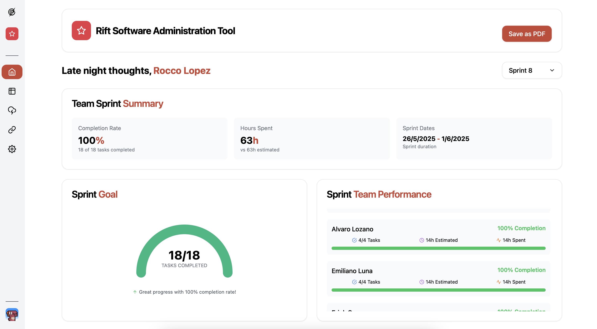
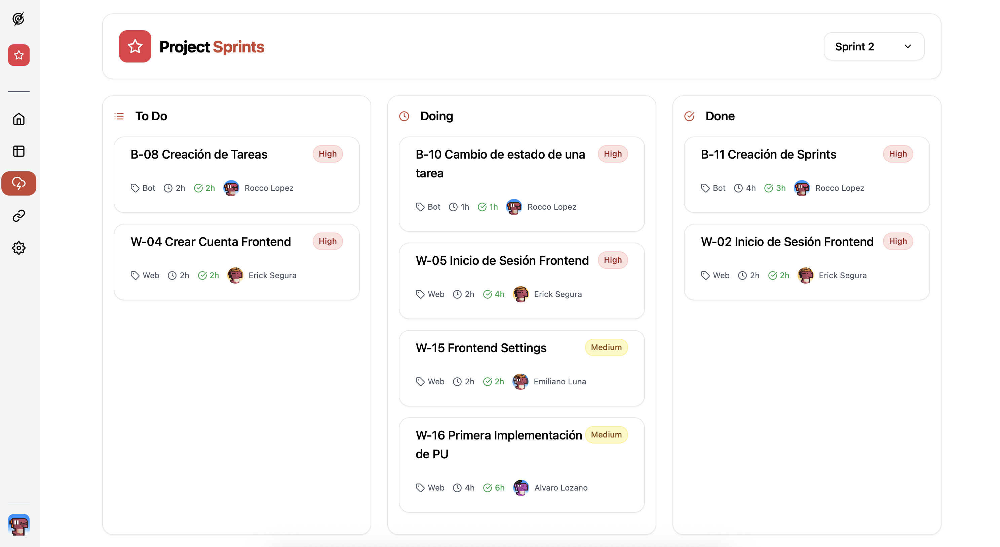
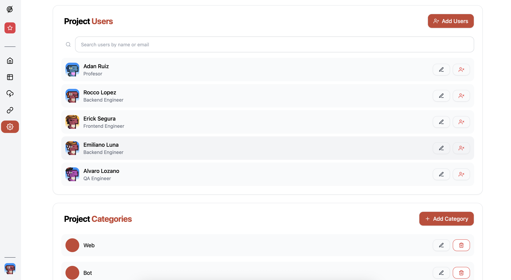
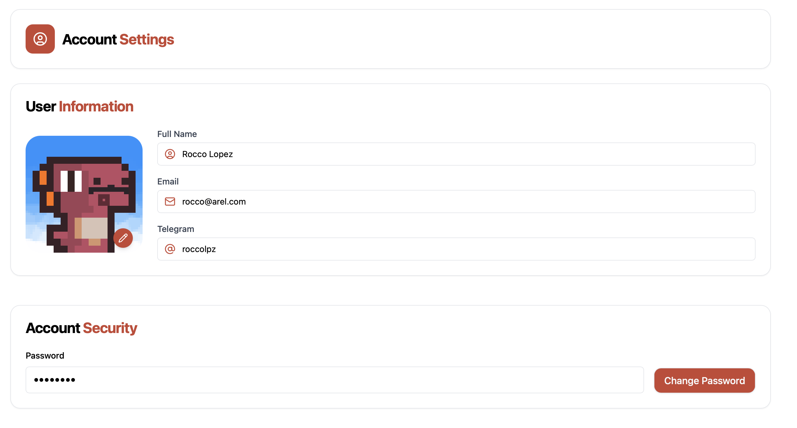
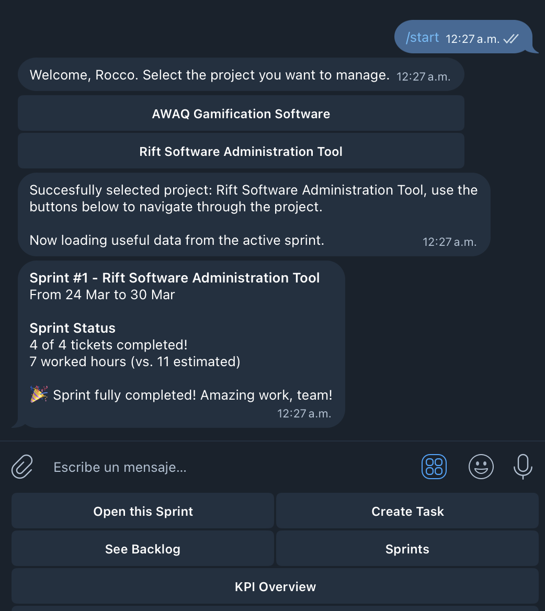
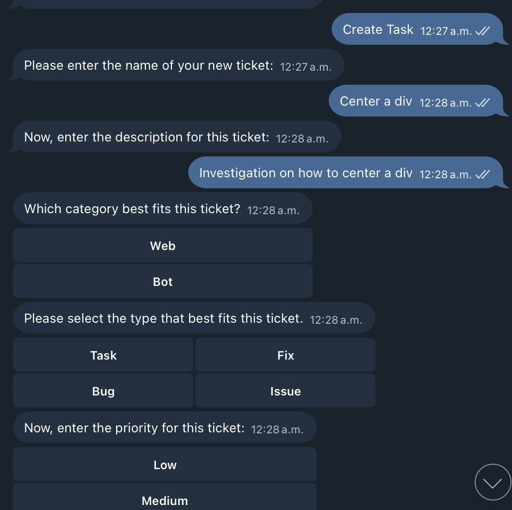
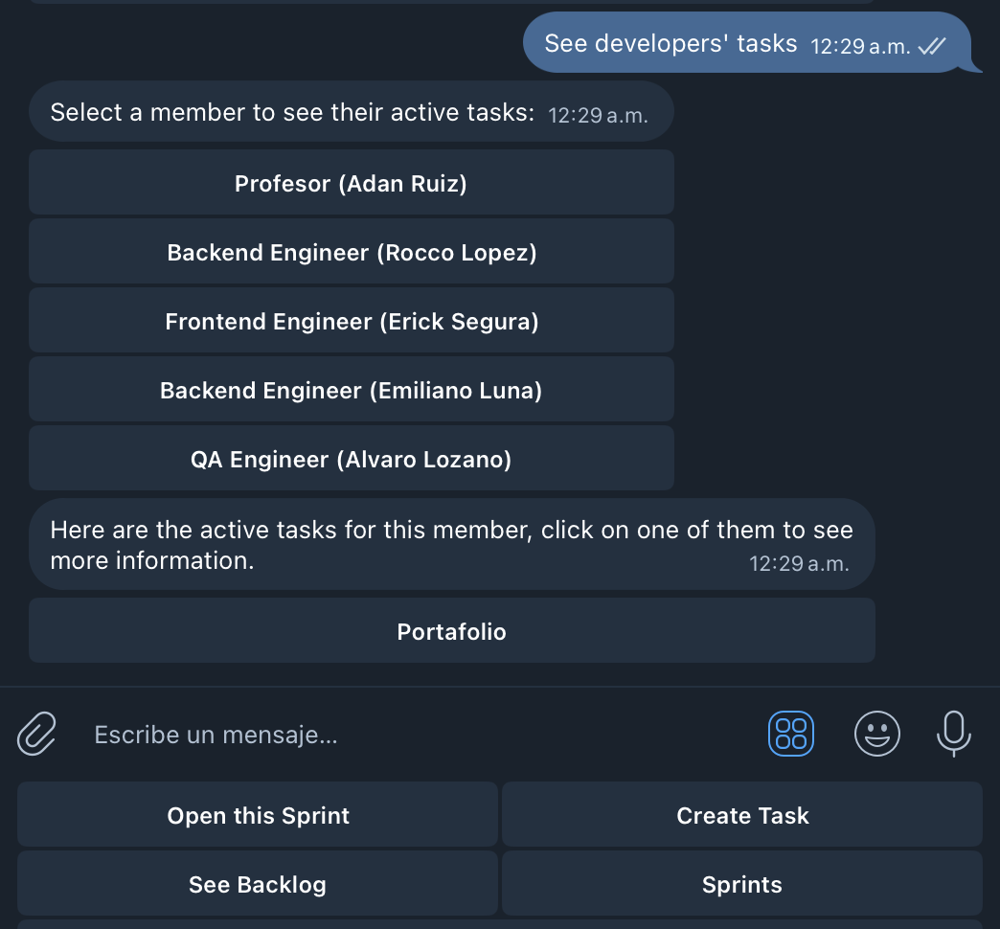

# Desarrollo e Implementación

## Tecnologías Utilizadas

### Frontend
- **Lenguajes**: HTML5, JavaScript, CSS
- **Frameworks/Bibliotecas**: React, Tailwind
- **Herramientas de Desarrollo**: ESLint

### Backend
- **Lenguajes**: Java
- **Frameworks**: Spring Boot (Para REST API) y Maven para compilación del proyecto.
- **Bases de Datos**: Oracle Autonomous Database (Autonomous Transaction Processing), utiliza SQL para el almacenamiento de información.

### Infraestructura
- **Servidores**: Oracle Cloud Infrastructure
- **Contenedores**: Docker, Oracle Container Registry, Kubernetes
- **CI/CD**: Oracle Devops

## Descripción de Módulos

### Módulo 1: Spring Boot REST API
- **Propósito**: Este módulo se encarga de implementar la lógica del backend para la aplicación, exponiendo servicios REST para que los clientes puedan interactuar con los datos y funcionalidades del sistema. Spring Boot facilita la creación rápida y sencilla de estas APIs REST.
- **Funcionalidades principales**:
  - Definir endpoints para responder a peticiones HTTP CRUD.
  - Gestiona la base de datos mediante controladores.
  - Facilita el desarrollo de varias posibles soluciones utilizando este mismo backend.

### Módulo 2: Frontend
- **Propósito**: Implementación de una interfaz gráfica web mediante React y Tailwind. Orientado a la gestión de proyectos ágiles de manera cómoda.
- **Funcionalidades principales**:
  - Manejo de tareas de proyectos agile de manera sencilla, interfaz intuitiva y de alta disponibilidad desde cualquier dispositivo, lugar y momento.
  - Aumentar accountability y visibility de las tareas en los proyectos de desarrollo de los equipos de trabajo en Oracle.

### Módulo 3: Telegram Bot
- **Propósito**: Implementación de un bot de telegram que ayuda a la gestión de tareas de proyectos ágiles de manera segura y accesible.
- **Funcionalidades principales**:
  - Ayuda a la gestión de las tareas desde otro tipo de interfaz, sin perder cohesión con el resto de componentes en la arquitectura
  - Ayuda a mantener una comunicación segura con el backend del proyecto, gracias a los certificados y la robusta seguridad que Telegram ofrece
  - Acceso a las tareas más útiles y usuales en una interfaz simple y pequeña.

## Demo del Producto Final
- **URL de demostración**: [Enlace a la demo en vivo]

## ¿Cómo desplegamos nuestra aplicación?
Gracias a los pipelines de Oracle DevOps, tenemos despliegues automatizados que nos permiten integrar y entregar nuevas versiones de nuestros servicios de forma continua, reduciendo errores humanos, mejorando la eficiencia del equipo y garantizando una entrega más rápida y confiable de nuestras aplicaciones en el entorno de Kubernetes.