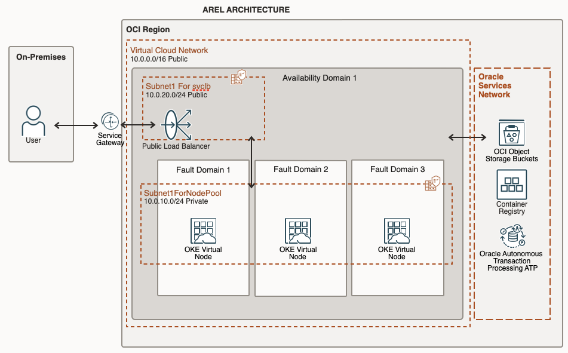
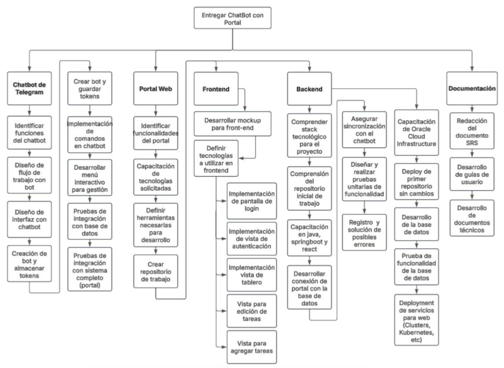
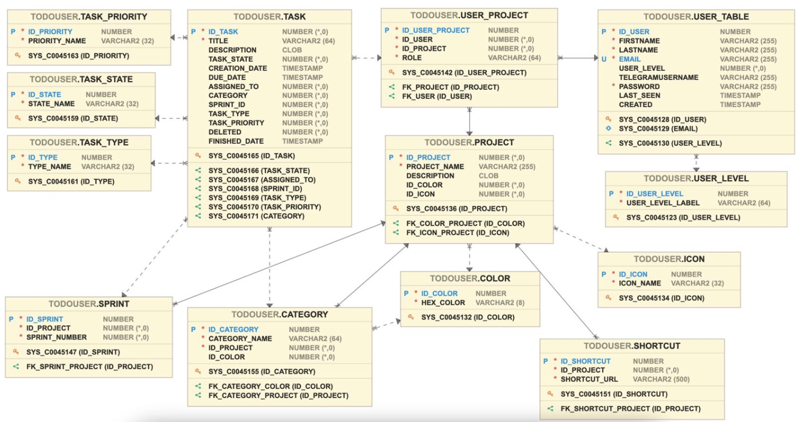

# Diseño del Sistema

## Arquitectura del Sistema
La arquitectura de nuestra solución usa un Load Balancer público para recibir el tráfico desde usuarios externos y dirigirlo al clúster de Oracle Kubernetes Engine (OKE), que está distribuido en tres Fault Domains dentro de un solo Availability Domain, garantizando alta disponibilidad y evita "single-failure points". Además, se integran servicios de Oracle como Object Storage, Container Registry y Autonomous Transaction Processing (ATP) para almacenamiento, despliegue de imágenes y base de datos gestionada.

## Diagramas

### Diagrama de Arquitectura
La arquitectura usa un Load Balancer público para recibir el tráfico desde usuarios externos y dirigirlo al clúster de Oracle Kubernetes Engine (OKE), que está distribuido en tres Fault Domains dentro de un solo Availability Domain, garantizando alta disponibilidad y evitar "single-failure points". Además, se integran servicios de Oracle como Object Storage, Container Registry y Autonomous Transaction Processing (ATP) para almacenamiento, despliegue de imágenes y base de datos gestionada.

### Diagrama WBS (Work Breakdown Structure)
[Insertar diagrama de clases]

### Diagrama de Base de Datos

