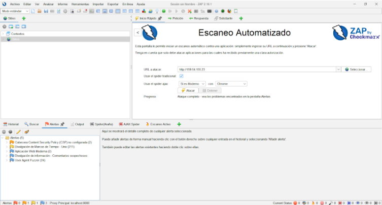
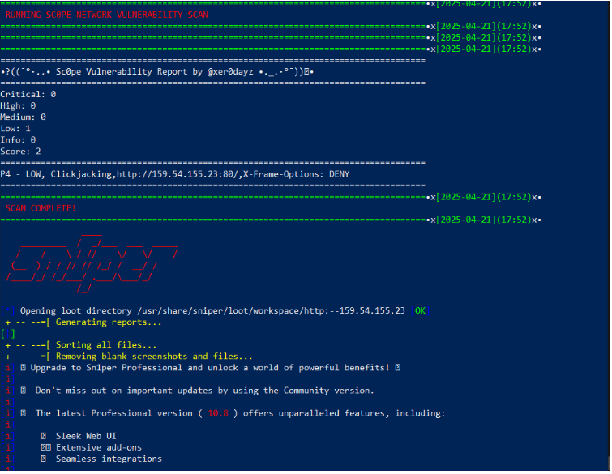
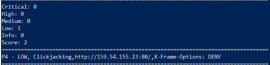

# Pruebas y Validación

## Estrategia de Pruebas
[Descripción general de la estrategia de pruebas implementada]

## Tipos de Pruebas Realizadas

### Pruebas Unitarias
- **Herramientas utilizadas**: [Ej: JUnit, Mockito]
- **Cobertura**: [Porcentaje de cobertura alcanzado]
- **Resultados principales**:

| TestId | Descripción de la prueba | Input | Output esperado | Resultado | Responsable de la prueba |
|--------|--------------------------|-------|-----------------|-----------|-------------------------|
| TC-01 | Verificar que TaskCreationCommands no es un bean de Spring | context.getBean(TaskCreationCommands.class) | Lanza excepción indicando que no es un bean de Spring | Falla | Alvaro |
| TC-02 | Instanciar TaskCreationCommands con dependencias nulas | new TaskCreationCommands(null, null, null).handleCreateTask(...) | Lanza NullPointerException | Falla | Alvaro |
| TC-03 | Instanciar TaskCreationCommands con mocks, pero sin beans de Spring | Instancia manual con mocks | Instancia creada, pero no es bean de Spring (assertFalse context.containsBean("taskCreationCommands")) | Falla | Alvaro |
| TC-04 | Verificar que KeyboardFactory no es inyectado como bean de Spring | context.getBean("keyboardFactory") | Lanza NoSuchBeanDefinitionException | Pasa | Alvaro |
| TC-05 | Crear tarea y verificar que se envía el mensaje correcto | handleTextInput con estado CREATE_TASK_ENTER_NAME | Mensaje enviado: "Now, enter the description for this ticket:" | Falla | Alvaro |
| TC-06 | Comando /ai debe disparar AI prompt | handleTextInput con "/ai suggest something" | Se llama aiCommands.sendPrompt | Pasa | Alvaro |
| TC-07 | Comando "Create Task" debe invocar TaskCreationCommands | handleTextInput con "Create Task" | Se llama taskCreationCommands.handleCreateTask | Pasa | Alvaro |
| TC-08 | Comando "See Backlog" debe invocar AgileCommands | handleTextInput con "See Backlog" | Se llama agileCommands.openBacklog | Pasa | Alvaro |
| TC-09 | Comando "KPI Overview" debe invocar KPICommands | handleTextInput con "KPI Overview" | Se llama kpiCommands.openKPIMenu | Pasa | Alvaro |
| TC-10 | Comando "Sprints" debe invocar sprintList | handleTextInput con "Sprints" | Se llama agileCommands.sprintList | Pasa | Alvaro |
| TC-11 | Comando "See developers' tasks" debe invocar task monitoring | handleTextInput con "See developers' tasks" | Se llama taskManagementCommands.selectUserForTaskMonitoring | Pasa | Alvaro |
| TC-12 | Flujo de creación de tarea debe setear título y pasar a descripción | handleTextInput con estado CREATE_TASK_ENTER_NAME y texto | Se llama taskCreationCommands.handleSetTitle | Pasa | Alvaro |
| TC-13 | Sin proyecto seleccionado debe disparar fallback | handleTextInput con selectedProject=null | Se llama agileCommands.noProjectSelectedManager | Pasa | Alvaro |
| TC-14 | Comando desconocido debe retornar mensaje por defecto | handleTextInput con comando desconocido | Se llama messageSender.sendMessage | Pasa | Alvaro |

### Pruebas de Rendimiento
- **Herramientas utilizadas**: JMeter
- **Escenarios probados**:

Se realizaron pruebas con 10, 100, 1000 y 10,000 usuarios simultáneos para ver el rendimiento de la aplicación:

| Escenarios | Samples | Promedio | Min | Max | Std.Dev | Error% |
|------------|---------|----------|-----|-----|---------|--------|
| E-1 | 100 | 102 | 98 | 110 | 2.57 | 0.00% |
| E-2 | 1000 | 109 | 95 | 199 | 12.61 | 0.00% |
| E-3 | 10000 | 603 | 97 | 3592 | 435.02 | 39.89% |
| E-4 | 40000 | 2392 | 0 | 71350 | 5176.62 | 65.15% |

### Pruebas de Seguridad
- **Herramientas utilizadas**: Zaproxy y Sn1per
- **Riesgos encontrados**

En las dos pruebas se observaron riesgos de nivel bajo.

